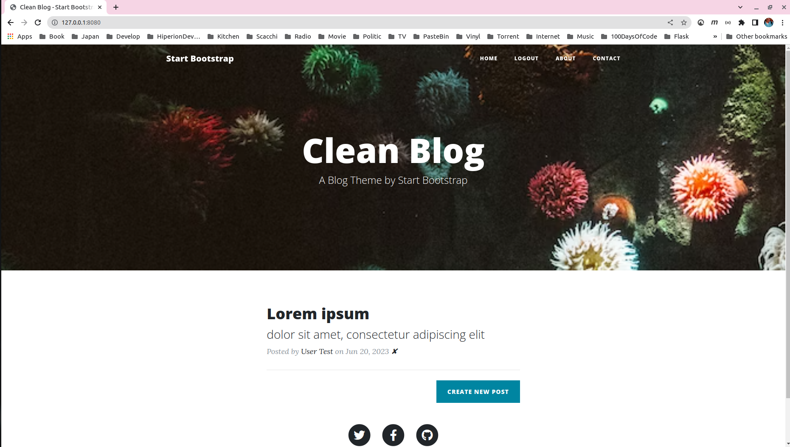
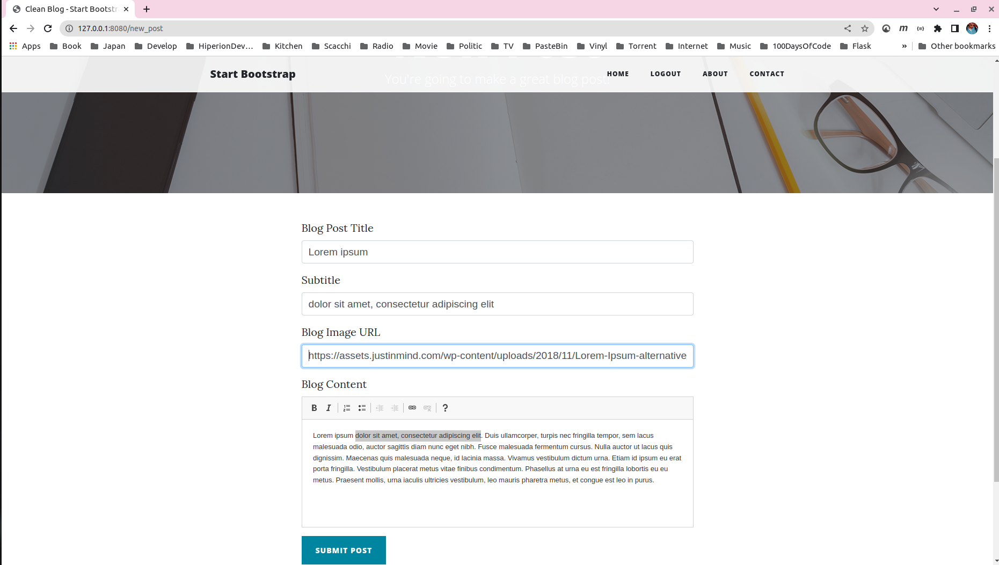
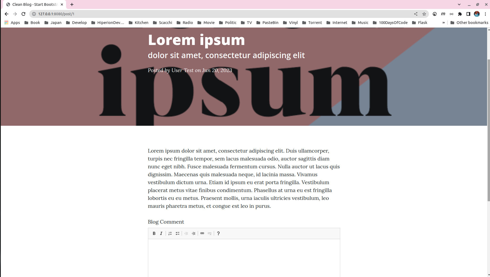
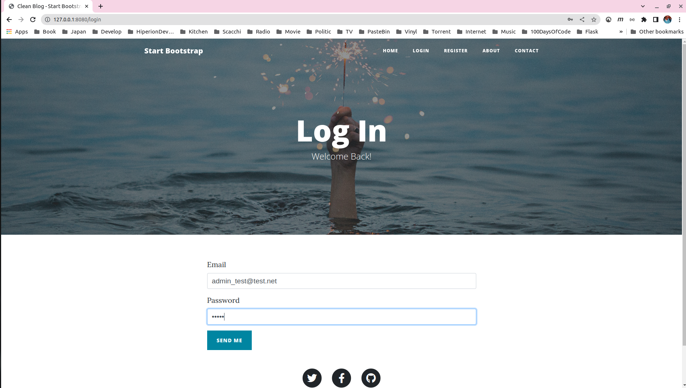
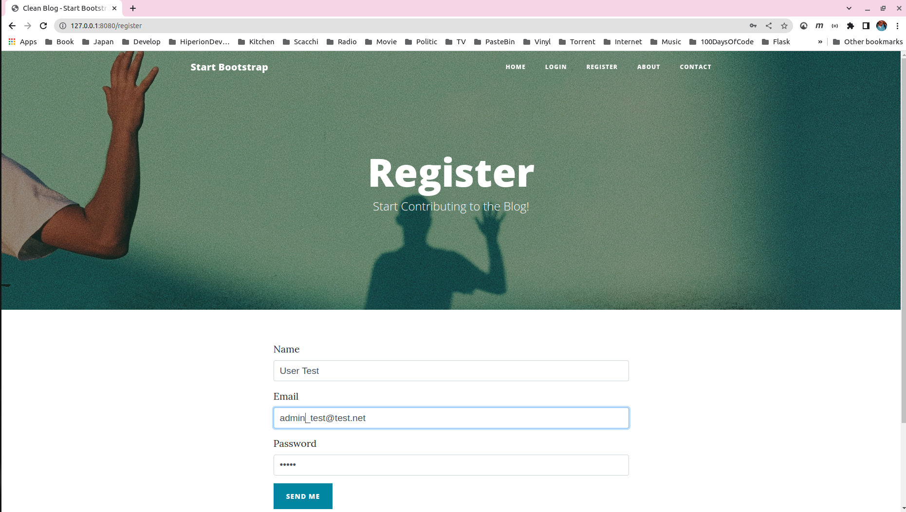

## Blog Site  

Simple blog site write in python with [**Flask**](https://flask.palletsprojects.com/en/2.3.x/) library       


###### It's a part of the **#100DaysOfCode** challenge by Angela Yu. ######


#### Prerequisites
You will need the following software to run the Blog Site :
 - [Python 3](https://www.python.org/downloads/)
 - [Flask](https://flask.palletsprojects.com/en/2.3.x/)
 - [Flask_Bootstrap](https://pythonhosted.org/Flask-Bootstrap/) 
 - [Flask_Wtf](https://flask-wtf.readthedocs.io/en/1.0.x/)
 - [Flask_CKEditor](https://flask-ckeditor.readthedocs.io/en/latest/)
 - [Flask-Login](https://flask-login.readthedocs.io/en/latest/)
 - [Flask_SQLAlchemy](https://flask-sqlalchemy.palletsprojects.com/en/3.0.x/) 
 - [Flask_Gravatar](https://pythonhosted.org/Flask-Gravatar/) 
 


#### Installation
To get started with the Blog Site, follow these steps:

1. **Clone** the repository:

```sh
git clone https://github.com/resole79/blog_site.git
```

2. **Install** Flask, Flask-Bootstrap, WTForms, Flask-WTF, Flask-CKEditor, Flask-SQLAlchemy, SQLAlchemy, Werkzeug, Flask-Login, Flask-Gravatar, python-dotenv

```sh
pip install Flask
pip install Flask-Bootstrap
pip install WTForms
pip install Flask-WTF
pip install Flask-CKEditor
pip install Flask-SQLAlchemy
pip install SQLAlchemy
pip install Werkzeug
pip install Flask-Login
pip install Flask-Gravatar
pip install python-dotenv

```


3. **Run** the **main.py** file:

```sh
python3 main.py
```     

4. **Run** the Blog Site on browse: 

```
http://127.0.0.1:8080/
```     


#### *File Structure*
 - **main.py**: Main program.
 - **form.py**: Contain the class form of project
 - **templates**: Folder contain html page
 - **static**: Folder contain images, css, and js folder

#### **Usage**

**How web site present**          

**Index Page**
<p align="center"><br><i>Index Page</i></p>     
          
          
**Insert/Edit Page**          
<p align="center"><br><i>Insert/Edit Page</i></p>       
            
**Show Post Page**          
<p align="center"><br><i>Show Post Page</i></p>       
            
**Login Page**          
<p align="center"><br><i>Login Page</i></p>       
            
**Register Page**
<p align="center"><br><i>Register Page</i></p>       
            

## **Credit**

Author : Emilio Reforgiato (resole79)

##
<p align="right"><a href="https://www.linkedin.com/in/emilio-reforgiato/" target=”_blank” ></a></p>


